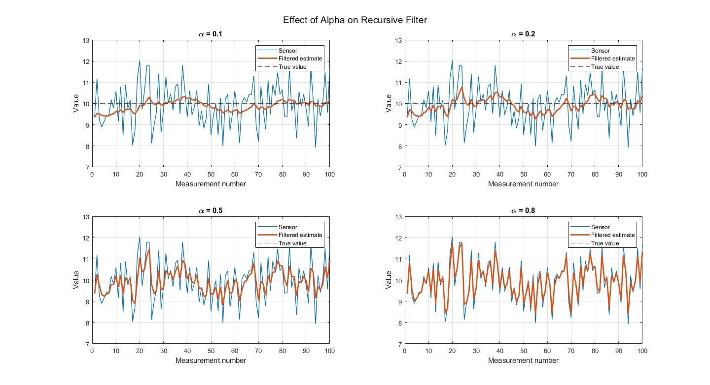
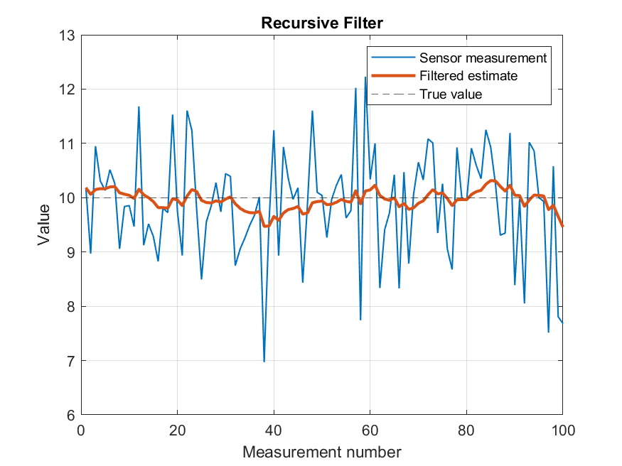

# 01 — Fixed-α EMA / First-Order IIR Low-Pass Filter: Response Time vs. Noise Trade-off

<p align="center">
  
</p>

## Aim

To implement a recursive (IIR) low-pass filter with a fixed smoothing parameter α, and characterize how α affects the trade-off between response time and noise suppression when estimating a noisy sensor measurement.

## Background

A real sensor rarely reports the exact value of a physical quantity. Its output is corrupted by noise, causing the measured value to fluctuate around the true value.

The measurement can be represented as:

```text
Zₖ = X_true + noise
```

A filter processes these noisy measurements to produce an estimate with reduced fluctuation.

### Recursive vs. Non-Recursive Filters

A **recursive** filter uses its previous output (estimate) to calculate the next output.

A **non-recursive** filter calculates each output using only the current and/or previous measurements, without using its own previous output.

This experiment uses a recursive filter — specifically, a fixed-α **Exponential Moving Average (EMA)**, which is mathematically equivalent to a **first-order IIR low-pass filter**.

## Recursive Filter Equation

The filter is defined as:

$$
X_k = (1-\alpha)X_{k-1} + \alpha Z_k
$$

where:

* `Xₖ` — current filtered/estimated value
* `Xₖ₋₁` — previous filtered/estimated value
* `Zₖ` — current sensor measurement
* `α` — filter parameter, where `0 < α < 1`

The value of α determines how strongly the filter responds to the newest measurement.

* **Low α** → more smoothing, slower response
* **High α** → less smoothing, faster response

## Apparatus

* MATLAB R2022b
* Synthetic sensor data
* Gaussian noise generated using `randn`
* Number of measurements: `N = 100`
* True value: `X_true = 10`
* Fixed α values: `[0.1, 0.2, 0.5, 0.8]`

The synthetic sensor measurement is generated as:

```text
Zₖ = X_true + noise
```

where:

```text
noise ~ N(0,1)
```

## Procedure

### 1. Single-α Run

File:

```text
single_alpha_ema.m
```

A fixed value of:

```text
α = 0.8
```

is used to filter the noisy sensor signal.

The sensor measurement, filtered estimate, and true value are plotted together.

### 2. Multi-α Comparison

File:

```text
alpha_comparison.m
```

The filter is evaluated using:

```text
α = [0.1, 0.2, 0.5, 0.8]
```

The same noise realization is used for all α values:

```matlab
rng(1)
```

This allows the effect of changing α to be compared without changing the underlying noise.

The four responses are displayed in a `2 × 2` subplot.

## Observations

### Low α

For example:

```text
α = 0.1
```

The filter gives more weight to its previous estimate and less weight to the newest measurement.

Consequently:

* Noise is suppressed more strongly.
* The output fluctuates less.
* The estimate responds more slowly to changes in the true value.

### High α

For example:

```text
α = 0.8
```

The filter gives more weight to the newest measurement.

Consequently:

* The output follows the sensor measurement more closely.
* More measurement noise passes through.
* The estimate responds faster to changes in the true value.

## Response-Time Example

Consider a step change in the true value from `10` to `20`.

With a low α such as `0.1`, the estimate moves gradually toward the new value:

```text
10 → 11 → 11.9 → 12.71 → ... → 20
```

With a high α such as `0.8`, the estimate moves much faster:

```text
10 → 18 → 19.6 → 19.92 → ... → 20
```

The exact values depend on the measurements and noise, but the general behavior remains the same.

## α Trade-off

The experiment demonstrates the fundamental trade-off of a fixed-α EMA:

| α    | Noise Suppression | Response |
| ---- | ----------------- | -------- |
| Low  | Higher            | Slower   |
| High | Lower             | Faster   |

Increasing α makes the filter respond faster, but allows more measurement noise to pass through.

Decreasing α provides stronger smoothing, but increases the time required for the estimate to respond to changes.

Therefore, **no single fixed α provides maximum noise suppression and maximum response speed simultaneously**.

## Limitation of a Fixed-α Filter

The main limitation of this approach is that α remains constant.

If the operating conditions change, the same α may no longer provide a suitable balance between smoothing and responsiveness.

For example:

* During a relatively stable period, a lower α could provide useful noise suppression.
* During a rapidly changing period, a higher α could provide faster tracking.

A fixed-α filter cannot automatically adjust this balance.

This motivates studying adaptive estimation techniques such as the **Kalman filter**, where the gain is determined from the estimated uncertainty of the system and measurements rather than being manually fixed to one constant value.
                           |

## Results

### Fixed-α Filter Response

<p align="center">
  
</p>

### α Comparison

<p align="center">
  
</p>

## Conclusion

A fixed-α EMA provides a simple computationally efficient method for reducing sensor noise.

The experiment demonstrates that α directly controls the balance between **noise suppression and response speed**:

```text
Lower α  →  More smoothing  →  Slower response

Higher α →  Less smoothing  →  Faster response
```

This makes the fixed-α EMA useful as a simple low-pass filtering technique, while also demonstrating why more adaptive estimation methods may be required when sensor and system dynamics vary over time.
